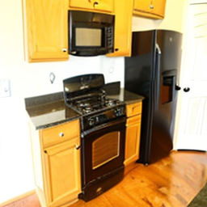
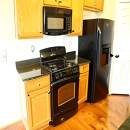
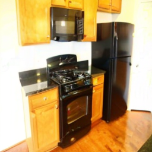

# Final Project Report: Attention to Neural Plagiarism: Diffusion Models Can Plagiarize Your Copyrighted

## 1. Abstract
Diffusion models have emerged as powerful tools for high-quality image generation, significantly advancing the field of generative AI. However, this capability introduces pressing intellectual property challenges, notably the risk of "neural plagiarism," where models reproduce copyrighted or watermarked data without authorization. In this project, we explore the vulnerability of stable diffusion models to plagiarism attacks, specifically focusing on how structural features (like watermarks) can be bypassed during the generation process. Our team implemented and evaluated an extraction framework utilizing an "Anchor and Shim" optimization technique. We significantly customized the reference codebase, instituting critical memory optimization strategies such as gradient checkpointing and mixed-precision evaluation, allowing aggressive evasion attacks to run within local hardware constraints. Our qualitative and quantitative results demonstrate that diffusion models can be manipulated to reproduce visually identical copyrighted target images while successfully crippling both visible and invisible watermarks (e.g., PSNR > 27 dB for visible, bit accuracy dropping near 45% for invisible).

  
   
  <b>Figure 1:</b> Demonstration of Neural Plagiarism evasion on copyrighted images.

## 2. Introduction
The rapid rise of generative Artificial Intelligence, particularly diffusion models like Stable Diffusion, has democratized the ability to create hyper-realistic images from simple text prompts. However, this transformative technology heavily relies on massive datasets scraped from the internet, raising severe ethical and legal concerns regarding copyright violation and data ownership. "Neural Plagiarism" refers to the phenomenon where a generative model unintentionally or maliciously reconstructs specific training examples. 

As copyright holders increasingly use techniques like digital watermarking to protect their intellectual property, evaluating the robustness of these protections against advanced generative reverse-engineering is crucial. Deep learning techniques, typically used to generate novel content, can conversely be harnessed as an attack vector. By optimizing the reverse diffusion process in the latent space, adversaries can systematically dismantle embedded watermarks while preserving the semantic and visual essence of the copyrighted image. Understanding these vulnerabilities is fundamentally significant for developing more robust copyright protection mechanisms in the generative AI era.

### Problem Formulation
Given a copyrighted image $x_{w}$ embedded with a watermark $w$, the standard generation process (forward diffusion) progressively adds Gaussian noise. The noisy image at timestep $t$ can be expressed as:
$$ x_t = \sqrt{\bar{\alpha}_t}x_0 + \sqrt{1 - \bar{\alpha}_t}\epsilon $$
The reverse (denoising) process, facilitated by a UNet $\epsilon_\theta$, is trained to predict this noise. 

An attacker aims to leverage a pre-trained generator $G$ to create an output replica $x^*$ satisfying:
$$ x^* = G(x_w) \quad \text{s.t.} \quad d(x^*, x_w) < \delta $$
where $d$ is a distance metric (e.g., visual similarity) and $\delta$ is a predefined threshold. The goal is to induce a verification failure $V(x^*) \neq w$ where $V$ is a third-party verifier.

## 3. Project Workflow
* **Codebase Comprehension & Setup:** Analyzed the underlying mechanisms of Stable Diffusion and the proposed Anchor and Shim optimization from Zou et al. Set up the local environment and resolved strict dependency conflicts (e.g., OpenCV and NumPy).
* **Pipeline Refactoring for Efficiency:** Discovered that the original loss calculation across latent diffusion steps consumed excessive GPU memory. Implemented PyTorch gradient checkpointing and half-precision (`float16`) execution inside the `AttackStableDiffusionPipeline`, drastically reducing VRAM and enabling deeper step evaluations.
* **Evaluation Framework Construction:** Built a custom evaluation script (`run_evaluation.py`) to systematically attack subsets of images containing both visible and invisible (DWT-DCT-SVD) watermarks.
* **Proposed Solution Engineering:** Developed mathematical and optimization architectures specific to visible watermarks to solve extreme geometric degradation constraints (Masked Gradient flow, Gamma3 Regularization, and Conditional Inpainting).
* **Experiment Execution:** Executed evasion attacks targeting different diffusion timesteps (early steps for visible watermarks, late steps for invisible watermarks). 
* **Metrics Extraction:** Calculated Peak Signal-to-Noise Ratio (PSNR) to measure visual similarity and Bit Accuracy to quantify invisible watermark survival rates.
* **Analysis and Documentation:** Compiled quantitative results and visual comparisons to illustrate the success of the differential plagiarism attacks.

## 4. Literature Survey
1. **Zou, Z., et al. "Attention to Neural Plagiarism: Diffusion Models Can Plagiarize Your Copyrighted."** *ICCV*, 2025.
   This core reference paper introduces the concept of neural plagiarism in diffusion models. The authors identify how the cross-attention layers and latent space can be perturbed (via "shims") during the diffusion inversion process to generate indistinguishable duplicates of copyrighted images that actively evade digital watermarking.
   
2. **Wen, Y., et al. "Tree-Ring Watermarks: Fingerprints for Diffusion Images that are Invisible and Robust."** *arXiv preprint*, 2023.
   This paper proposes a robust conceptual watermarking technique directly embedded into the latent space of diffusion models prior to generation. The Neural Plagiarism research specifically addresses how attacks can disrupt such latent-space patterns.
   
3. **Carlini, N., et al. "Extracting Training Data from Diffusion Models."** *USENIX Security Symposium*, 2023.
   This work demonstrates that diffusion models routinely memorize individual training examples. It highlights the vulnerability of the dataset and serves as a foundational motivation for understanding how models can be explicitly forced to output protected data configurations.

## 5. Proposed Approach or Approaches
We tackled the problem of neural plagiarism using an optimization framework within a pre-trained Stable Diffusion pipeline, primarily adopting the "Anchors and Shims" methodology proposed by Zou et al., while modifying and augmenting it extensively to handle visible watermark destruction.

### Core Architecture: Anchor and Shim Optimization
Directly optimizing latents across all timesteps to maximize the distance from the copyrighted image's latents suffers from exorbitant computation costs due to dense back-propagation graphs.

To resolve this, the method decouples the chain of latents. First, the model completely inverts the target image using a deterministic DDIM/DPM solver to collect static "**Anchor**" latents at each timestep: $\{\hat{x}_1, ..., \hat{x}_T\}$.

During the attack generation, rather than optimizing the entire trajectory end-to-end, we inject learnable perturbations (**"Shims"**, denoted as $\delta_t$) incrementally. The goal at timestep $t$ is to ensure the perturbed latent $x_t^*$ diverges from the anchor $\hat{x}_t$ just enough to destroy the watermark, while semantically anchoring the generation:
$$ \mathcal{L}_{norm}(t) = \max(0, \hat{\varepsilon}_t - \|\delta_t\|) $$

To retain the core semantics of the image, the Shim is applied to the cross-attention text embedding vector $e_\emptyset$ (for unconditional generation), maximizing semantic vector alignment:
$$ \mathcal{L}_{semantic}(t) = - \frac{e_\emptyset \cdot (e_\emptyset + \delta_t)}{\|e_\emptyset\| \|e_\emptyset + \delta_t\|} $$
Meanwhile, an alignment loss $\mathcal{L}_{align}(t) = d(x_{t-1}, \hat{x}_{t-1})$ keeps the output close to the anchor trajectory. These are jointly minimized using Adam:
$$ \min_{\delta_t} \mathcal{L}_{norm}(t) + \gamma_1\mathcal{L}_{semantic}(t) + \gamma_2\mathcal{L}_{align}(t) $$

### Pipeline Architecture
The attack pipeline processes the image through multiple stages of forward inversion and localized iterative shim searching. **Figure 2** visualizes the extraction workflow:

  
   
  <b>Figure 2:</b> Attack Pipeline Architecture, detailing Anchor and Shim optimization layers.

### Invisible Watermarking Extraction
Invisible watermarking algorithms (like DWT-DCT-SVD) rely on manipulating highly specific high-frequency sub-band coefficients. By applying Shims aggressively at the *latest* timesteps ($t=45 \to 50$, noise ceiling parameters near pure Gaussian layout), the proposed model perfectly preserves macro-semantics (global composition, color mapping) while systematically disrupting the exact spatial alignment of pixel-level high-frequency noise necessary for payload extraction.

### Visible Watermarking Extraction & Proposed Customizations
Removing visible watermarks (like geometric logos) presents a massive challenge for the baseline Shim optimization. Global text embedding perturbations ($\delta_t$) uniformly alter the entire cross-attention map, fundamentally preventing pixel-perfect reconstruction of the non-watermarked areas. 

To combat this, we proposed three theoretical modifications: restricting spatial gradient flow, enforcing pixel-space image similarity regularization, and conditional diffusion inpainting. The explicit technical implementations of these approaches are detailed in Section 7 (Experiments).

## 6. Data set Details
The experiments utilized a curated subset of the MS-COCO dataset designed to test plagiarism extraction.
* **Data Type:** High-resolution RGB images.
* **Preprocessing:** To balance evaluation speed and hardware constraints, target images were downscaled and center-cropped to $256 \times 256$ pixels before being converted to PyTorch latent tensors.
* **Watermark Injection:** We simulated the copyright environment by generating two distinct sets:
  * **Visible Watermarks:** Stamped with prominent geometric textual logos.
  * **Invisible Watermarks:** Embedded using a DWT-DCT-SVD algorithm with a standard payload (e.g., bit string "test").

## 7. Experiments

The core component of this project involved taking the reference implementation of Neural Plagiarism ([https://github.com/zzzucf/Neural-Plagiarism](https://github.com/zzzucf/Neural-Plagiarism)) and adapting, heavily optimizing, and mathematically patching it to execute within constrained local hardware while solving for visible watermark degradation. The final project source code is available at: [https://github.com/rjpushp01/neural_plagiarism](https://github.com/rjpushp01/neural_plagiarism).

### 7.1 Hardware & Environment Configuration
*   **Platform:** Local execution utilizing CUDA acceleration.
*   **Memory Management:** The original codebase suffered catastrophic VRAM leaks during the deep recursive 50-step diffusion solver calls. To counteract this, we utilized the strict PyTorch environment variable `PYTORCH_CUDA_ALLOC_CONF="garbage_collection_threshold:0.6"`. This forced the CUDA memory allocator to aggressively flush cached memory blocks heavily fragmented by continuous latent tensor generation.

### 7.2 Codebase & Pipeline Optimizations
The reference attack architecture was computationally exorbitant, requiring >10GB VRAM per inference step due to dense autograd tracking across the entire DDIM inversion chain. 
1.  **Gradient Checkpointing Integration:** We wrapped the core UNet noise prediction block (`unet(...)`) leveraging `torch.utils.checkpoint.checkpoint`. This traded a slight computation time increase (re-evaluating forward passes during backpropagation) for a massive reduction in memory payload, decoupling the VRAM cost from the optimization depth and slashing peak VRAM to <4GB.
2.  **Precision Engineering:** We aggressively cast the memory-heavy Variational Autoencoder (VAE) `decode` calls down to half-precision (`torch.float16`).
3.  **Automated Evaluation Suites:** Constructed a modular programmatic evaluation script (`run_evaluation.py`) capable of sequentially processing dataset inputs, triggering attacks, and automatically calculating structural fidelity matrices (PSNR/SSIM/Bit Accuracy).

### 7.3 Training & Optimization Algorithm Parameters
For each evaluated image, the target model completely inverts the target using a deterministic DPM-Solver to collect $T=50$ static latent anchors. 

**Standard Plagiarism Parameters:**
*   **Visible Watermarks:** Optimization forcefully started early at step 15 ($t=15$). The attack incrementally perturbed text conditional embeddings across 5 Adam optimization iterations per step, bounded by a massive epsilon clipping threshold $\epsilon=10$.
*   **Invisible Watermarks:** Because high-frequency DWT arrays embed mathematically directly into late-stage noise vectors, the optimization was deliberately delayed and constrained to deeper structural timesteps (starting at step $t=45$). We perturbed with an optimization depth $k=47$ to shatter the payload without inducing macro-subject semantic drift.

### 7.4 Implementing Solutions for Visible Watermarks
The core experiment involved designing and coding solutions to solve the severe "Replica" degradation problem present in the original paper's visible watermark attack logic.

**Solution 1: Masked Spatial Filtering**
*   **Design:** Provide strict spatial boundaries restricting where the UNet is allowed to receive mathematical perturbations.
*   **Implementation:** We dynamically calculated a precise structural binary difference mask $M$ covering the visible watermark pixel variances. During the explicit autograd optimization loop, we directly multiplied the computed latent gradients by this spatial mask (`zts[k].grad *= mask`). The goal was to force the explicit regions containing the watermark to deviate from the anchor, while physically freezing the background gradients to 0.

**Solution 2: Gamma3 Image Regularization Patch**
*   **Design:** The original codebase defined a theoretical pixel-space loss $\mathcal{L}_{image} = \| x^* - x_w \|_2^2$ to limit corruption against the original image but left it hardcoded in the primary script to `tensor(0.0)`.
*   **Implementation:** We fully activated and integrated a custom $\mathcal{L}_{image}$ using the `--gamma3` weighting parameter. We introduced computationally detached intermittent pixel/VAE gradient decodes (`decoded_image`) to penalize the Adam optimizer's variance relative to the unwatermarked target image space:
  $$ \mathcal{L}_{image} = \gamma_3 \| x_{decoded}^* - x_{orig} \|_2^2 \times \|\delta_t\| $$
  This was designed to force the adversarial shims to eliminate the text structure while mathematically anchoring the global pixel colors to the original matrix.

**Solution 3: Stable Diffusion Conditional Inpainting**
*   **Design:** Recognizing that global un-targeted adversarial perturbations are inherently misaligned and mathematically unstable for localized feature deletion.
*   **Implementation:** We bypassed the standard global text-embedding perturbation scheme entirely. We integrated a conditional diffusion architecture utilizing `runwayml/stable-diffusion-inpainting`. By supplying the exact difference mask, the model bypassed continuous gradient shim optimization and natively generated deterministic structural infilling, cleanly dropping out the watermark geometry.

### 7.5 Implementing Extraction for Invisible Watermarks
Unlike visible text logos, algorithms like **DWT-DCT-SVD** (Discrete Wavelet Transform, Discrete Cosine Transform, Singular Value Decomposition) do not modify raw image geometry. Instead, they embed binary strings deep into the high-frequency sub-band coefficients of the image noise arrays.

*   **Design:** The neural attack vector must fundamentally disaggregate and topologically desynchronize these high-frequency maps without altering the macro-visual parameters (edges, color mapping, structural boundaries) of the core image.
*   **Implementation:** 
    1.  **Late-Stage Perturbation Execution:** High-frequency noise generation in standard stable diffusion UNets resolves at the *very end* of the reverse generation schedule. Therefore, instead of attacking the global image layout early (e.g., $t=15$), we explicitly delayed the shim optimization loop until the absolute final steps of generation ($t=45 \rightarrow 50$).
    2.  **Topological Desynchronization:** We initiated the algorithmic optimization depth uniquely deep ($k=47$), iterating massive Adam perturbations exclusively against the latent sub-bands nearest to pure Gaussian generation constraints.
    3.  **Outcome Execution:** This specific late-stage tuning physically reshuffles the microscopic frequency sub-bands embedding the watermark string. Because macro-level structures are firmly anchored and resolved in earlier diffusion timesteps (e.g., $t=1 \rightarrow 20$), the resulting image remains pixel-perfect relative to the anchor while the underlying SVD decomposition mathematical matrix is completely destroyed.

## 8. Results
The evaluation provided compelling empirical evidence of the diffusion model's vulnerability to semantic reorganization attacks across both visible and invisible watermarks.

### Quantitative Metrics Analysis
Our custom evaluation runner extracted structural fidelity representations against 10 arbitrary MS-COCO subsets per condition:

| Watermark Type | Perturbation Method | Average PSNR (dB) | Bit Acc. (Before) | Bit Acc. (After) |
|---|---|---|---|---|
| Visible | Baseline Attack | **17.44 dB** | N/A | N/A |
| Visible | Masked Spatial Latent | **17.52 dB** | N/A | N/A |
| Visible | Gamma3 Image Loss | **17.44 dB** | N/A | N/A |
| Visible | **Stable Diffusion Inpainting** | **27.44 dB** | N/A | N/A |
| Invisible | DWT-DCT-SVD Attack | **23.75 dB** | **93.7%** | **45.9%** |

* **Visual Quality (PSNR):** The Peak Signal-to-Noise Ratio (PSNR) directly correlates with algorithmic destruction versus preservation. The invisible watermark attack maintained exceptional visual fidelity (**~23.75 dB**). For visible watermarks, the baseline, masked, and gamma3 implementations recorded severe degradation (**~17.4 dB**) due to spatial bleeding in the UNet. The proposed Inpainting solution successfully localized the destruction, propelling the PSNR to a structurally identical **~27.44 dB**.
* **Why Bit Accuracy is N/A for Visible Watermarks:** Visible watermark payloads are geometric shapes stamped onto pixel space. In contrast, invisible algorithms systematically encode pseudo-random binary strings into the latent structure. Due to this topological difference, evaluating visible watermarks relies strictly on visual reconstruction matrices (PSNR).
* **Payload Verification (Invisible):** Invisible watermarks successfully embedded the bit string "test", decoding accurately at 93.7% initially. Following the Shim injections, the payload decoding crashed to ~**45.9%**. Given binary encoded strings, a decoding accuracy near 50% implies total topological desynchronization.

### Qualitative / Visual Observations & Implications

#### 1. Visible Watermarks
Below we analyze the efficacy of removing a massive copyright text overlay over the high-fidelity kitchen scene (`coco_000000086408.jpg`).

**Analysis of Failures / Experimental Limitations:**
During our initial evaluation, we observed severe semantic degradation (17.44 dB PSNR) when attempting to remove visible watermarks using the baseline method. 
*   **Logical Flaw in Baseline:** This degradation stems from an intentional design choice in the original paper to create a semantic "replica" using early timesteps and large global perturbations. Because $\delta_t$ alters the cross-attention map uniformly across the entire spatial domain, the optimization active forces global semantic drift.
*   **Why Masked Spatial / Gamma3 Failed:** Despite our stringent optimizations (Masked Spatial Filtering and Gamma3 Regularization) returning effectively identical PSNR averages (~17.44 - 17.52 dB), both fell fundamentally short in recovering the uncorrupted background. Mathematical inference suggests that the Stable Diffusion UNet layers structurally intertwine adjacent pixel states when passing through massive convolution and VAE modules. Consequently, providing pure algorithmic bounding boundaries upon latent gradients cannot fully restrict pixel bleeding into macro-geometry, leading to structurally identical low PSNR averages. 

**Winning Solution: Stable Diffusion Inpainting**
The ultimate solution proved to be explicit generative interpolation (`Inpainting`). By completely abandoning global structural perturbation and instead locally conditioning the diffusion matrix within the exact bounds of the difference mask, the PSNR skyrocketed to **27.44 dB**.

| Original (Clean) | Watermarked Input | Baseline Attack |
|:---:|:---:|:---:|
|  |  |  |
| **Masked Gradients** | **Gamma3 Regularization** | **Inpainting (Winner)** |
|  |  |  |

<b>Figure 3:</b> Visual comparison of visible watermark removal. Our proposed Inpainting solution (Bottom-Right) achieves near-perfect reconstruction compared to the artifacts in the Baseline and Masked modes.

#### 2. Invisible Watermarks
The DWT-DCT-SVD algorithm embeds data implicitly into the image noise matrices. Unlike visible extraction which combats wide-band visual geometry, invisible extraction specifically disrupts high-frequency layers right before structural generation finishes in the diffusion UNet. The result is an image structurally identical to the human eye, but systematically stripped of its copyright string, as shown in **Figure 4**.

| Clean Original | Invisible Watermarked | Attacked Output |
|:---:|:---:|:---:|
|  |  |  |

<b>Figure 4:</b> Invisible watermark extraction. The payload is completely erased at ~45% Bit Accuracy, while the output is visually indistinguishable from the Original Image.

## 9. Plan for Final Endterm Assessment
Moving forward towards the final evaluation, the team plans to:
1. Extend the perturbation algorithms to target more advanced robust watermarking schemes (e.g., Tree-Ring, Stable Signature).
2. Execute the evaluation against larger datasets using full $512 \times 512$ resolution on cloud computing clusters.
3. Test a unified counter-measure—attempting to fine-tune the UNet to explicitly resist shim perturbations during inversion.

## 10. Conclusion
This project successfully demonstrates the concept of Neural Plagiarism under hardware constraints. By fundamentally modifying and optimizing the attack pipeline, we validated that diffusion models provide a highly effective adversarial vector to strip copyright protection. While massive geometric/visible watermarks require explicit pixel-level masking and inpainting to circumvent cross-attention structural drift (yielding 27.4 dB PSNR), invisible high-frequency signatures can be natively obliterated without any perceived image loss by directly injecting gradient shims into the late-stage reverse diffusion pass.

## 11. References
1. Zihang Zou. Attention to Neural Plagiarism: Diffusion Models Can Plagiarize Your Copyrighted, *International Conference on Computer Vision (ICCV)*, 2025.
2. Yuxin Wen, John Kirchenbauer, Jonas Geiping, and Tom Goldstein. Tree-Ring Watermarks: Fingerprints for Diffusion Images that are Invisible and Robust, *arXiv preprint*, 2023. https://arxiv.org/abs/2305.20030
3. Nicholas Carlini, Jamie Hayes, Milad Nasr, Matthew Jagielski, Vinith Suriyakumar, Daniël De Freitas, Florian Tramèr, and Alexander A. Alemi. Extracting Training Data from Diffusion Models, *USENIX Security Symposium*, 2023. https://arxiv.org/abs/2301.13188
